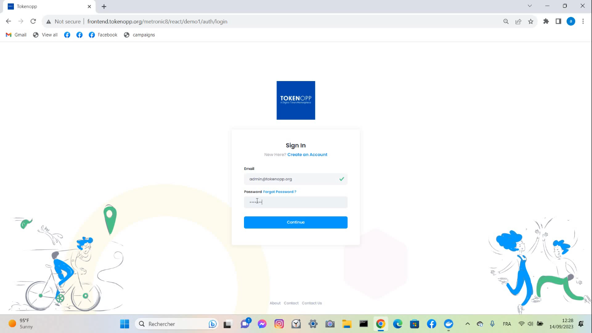

# Decentralized Fundraising Platform

Our project aims to create a cutting-edge fundraising platform leveraging the power of the Ethereum blockchain. Built upon the robust Go-Ethereum framework, our platform will provide an innovative solution for startups seeking capital and investors looking to support promising ventures.

**Graduation Internship Report:** 
[Graduation Internship Report](./Report/Decentralized_Fundraising_Platform_Presentation.pdf)

**Presentation:** 
[Presentation](./Report/Final_Version_Rami_Mechergui_PFE.pdf)

## Tech Stack

**Client:** Metronic Template

**Server:** Node, Express 

**Database:** MongoDB

**Blockchain:** Go-Ethereum

**Reverse-Proxy:** Traefik

## App Architecture


## Run Locally

Create a Domain and a subdomain dedicated to each service . This is our example : 

**tokenopp.org:** Domain

**traefik.tokenopp.org:** Subdomain dedicated to trafeik dashboard service

**frontend.tokenopp.org:** Subdomain dedicated to frontend service

**backend.tokenopp.org:** Subdomain dedicated to backend service

**blockchain.tokenopp.org:** Subdomain dedicated to blockchain service

**monitordashboard.tokenopp.org:** Subdomain dedicated to montioring service

**monitorapi.tokenopp.org:** Subdomain dedicated to monitoring service

**validator2.tokenopp.org:** Subdomain dedicated to frontend service

**validator3.tokenopp.org:** Subdomain dedicated to frontend service

**bootnode.tokenopp.org:** Subdomain dedicated to bootnode service


## For Linux Users

**Setting Up Local DNS with Dnsmasq :**

```bash
sudo systemctl stop systemd-resolved
sudo systemctl disable systemd-resolved
```
**Step 1 : Install DNSUtils, DNSMasq:**

```bash
sudo apt update && sudo apt install dnsmasq && sudo apt install dnsutils
```
**Step 2: Create the DNSMasq configuration file**

```bash
dnsmasq_conf="no-dhcp-interface=enp2s0f0
bogus-priv
domain=tokenopp.org
expand-hosts
local=/tokenopp.org/
domain-needed
no-resolv
no-poll
server=8.8.8.8
server=8.8.4.4"
```

```bash
sudo echo -e "$dnsmasq_conf" > /etc/dnsmasq.d/tokenopp.org
```

```bash
sudo systemctl restart dnsmasq
```

**Step 3: Add container DNS records in the file./etc/hosts. The records in hosts file will be used by DNSMasq for client responses**

Start the server


```bash
sudo nano /etc/hosts  
```

```bash
#traefik
172.17.0.1 traefik
#monitorapi
172.17.0.1 monitorapi
#monitordashboard
172.17.0.1 monitordashboard
# backend
172.17.0.1 backend
# frontend
172.17.0.1 frontend
# bootnode 
172.17.0.1 bootnode
# validator1
172.17.0.1 blockchain
# validator2
172.17.0.1 validator2
# validator3
172.17.0.1 validator3
```
**Step 4: Restart DNSMasq service**

```bash
sudo systemctl restart dnsmasq.service
```

## For Windows Users

**Step 1 – Browse to and open the Host File**

```bash
c:\windows\system32\drivers\etc\hosts.file
```
**Step 2 – Add the following format**

```bash
#traefik
Docker_Host_IP traefik
#monitorapi
Docker_Host_IP monitorapi
#monitordashboard
Docker_Host_IP monitordashboard
# backend
Docker_Host_IP backend
# frontend
Docker_Host_IP frontend
# bootnode 
Docker_Host_IP bootnode
# validator1
Docker_Host_IP blockchain
# validator2
Docker_Host_IP validator2
# validator3
Docker_Host_IP validator3
```
**In the root folder :**

```bash
docker compose up -d
```
## Screenshots





This screenshot shows the bootnode logs and how three were nodes connected to each other through bootnode


This screenshot shows node peers from one node 


## Authors

- [@RamiMechergui](https://github.com/RamiMechergui)


## Environment Variables

To run this project, you will need to add the following environment variables to your .env file

Environment variables in the root folder : 


`Domain_Name=tokenopp.org`

**Note : This is only an example of the domain name**

In our project, we used MailJet Service to send mails to the each user in order to be authenticated.That's why you have to create an account on MailJet and replace those Two Keys with your own keys.

Environment variables in the backend folder : 

`API_KEY='Your own API_KEY'` 
`SECRET_KEY='Your own SECRET_KEY'`


## Badges

Add badges from somewhere like: [shields.io](https://shields.io/)

[](https://choosealicense.com/licenses/mit/)
[](https://opensource.org/licenses/)
[](http://www.gnu.org/licenses/agpl-3.0)

